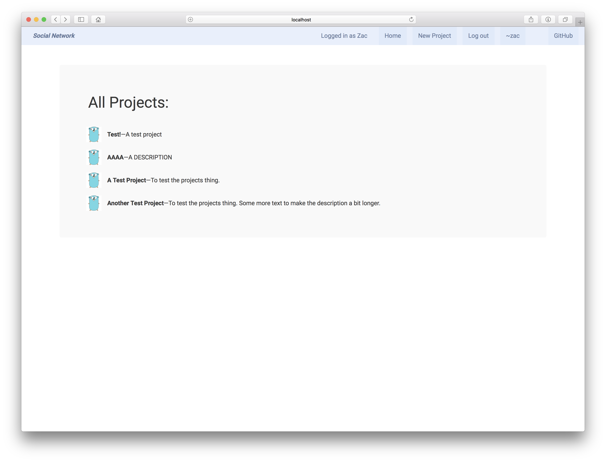
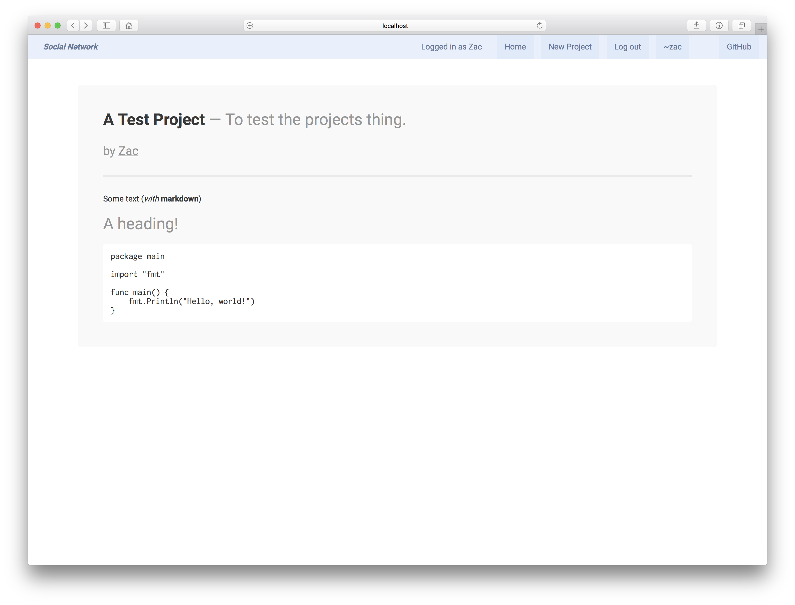

This is quite a simple social network, for me to learn HTTP programming in Go, and as a demonstration of how simple a basic social network can be to make.



It's almost completely functional. It's current features include:

 - Creating an account
 - Adding a project
 - Logging in
 - Viewing a list of all projects
 - Viewing a single project's page

There are a few things left to do:

 - Changing your profile picture
 - Adding links to a project, e.g. GitHub
 - Custom CSS on your project's page
 - Maybe even custom HTML
 - Host it somewhere?



## Installing it locally

First, you'll need to make a database. I'm using [MAMP](https://www.mamp.info/en/), but you can use anything (XAMPP, plain MySQL server, etc...) Here's a schema to use (exported from phpMyAdmin):

```sql
SET SQL_MODE = "NO_AUTO_VALUE_ON_ZERO";
SET time_zone = "+00:00";

CREATE TABLE `projects` (
  `project_id` int(11) NOT NULL,
  `title` tinytext NOT NULL,
  `description` text NOT NULL,
  `content` text NOT NULL,
  `date_created` datetime NOT NULL,
  `author` int(11) NOT NULL
) ENGINE=InnoDB DEFAULT CHARSET=utf32;

CREATE TABLE `sessions` (
  `session_id` bigint(11) NOT NULL,
  `user_id` int(11) NOT NULL
) ENGINE=InnoDB DEFAULT CHARSET=utf32;

CREATE TABLE `users` (
  `user_id` int(11) NOT NULL,
  `user_name` tinytext NOT NULL,
  `display_name` tinytext NOT NULL,
  `password_hash` text NOT NULL,
  `date_joined` date NOT NULL,
  `profile_picture` text NOT NULL
) ENGINE=InnoDB DEFAULT CHARSET=utf32;

ALTER TABLE `projects`
  ADD PRIMARY KEY (`project_id`),
  ADD KEY `AUTHOR` (`author`);

ALTER TABLE `sessions`
  ADD PRIMARY KEY (`session_id`),
  ADD KEY `USER_ID` (`user_id`);

ALTER TABLE `users`
  ADD PRIMARY KEY (`user_id`);

ALTER TABLE `projects`
  MODIFY `project_id` int(11) NOT NULL AUTO_INCREMENT, AUTO_INCREMENT=3;

ALTER TABLE `users`
  MODIFY `user_id` int(11) NOT NULL AUTO_INCREMENT, AUTO_INCREMENT=8;
```

I've also put this code [here](stuff/schema.sql), for easy importing.

This will create the three necessary tables: _projects_, _sessions_, and _users_, but won't add any rows to them.

After you've made the database, get the code with:

```
go get -u github.com/Zac-Garby/social-network
```

If you're using MAMP to host your database, and you're on macOS, the current SQL server location _should_ be fine (`root:root@unix(/Applications/MAMP/tmp/mysql/mysql.sock)/social-network`). If this doesn't work (tells you that the file cannot be found) or you're not using MAMP on macOS, you'll have to find where the Unix Socket file is for your database, or connect to it a different way (e.g. TCP). Edit the string in _main.go_ to whatever you need for it to connect. The default also assumes you named your database _social-network_.

Once you've done that, everything should work. Navigate to the root of the source directory in a terminal, and run:

```
go run main.go
```

Which will start the web server. Then, go to [localhost:8080](localhost:8080). It should give you the login screen, from which you can create a new account or log in.

## A few problems on Firefox

If you want to use Firefox, I wouldn't reccomend it. Until I fix it, on Firefox:

 - The login screen is messed up.
 - Profile pictures don't load properly.

It's possible this is only firefox on Linux, and it might also happen on other browsers too.

# Contributing

If you want to contribute some code, it's probably a good idea to open an issue first saying what you're going to do so nobody does the same thing at the same time. This might be unnecessary if you're making a tiny change. Then, fork the repository and make some changes, then submit a PR.